## 项目历史

> ** 悟已往之不谏，知来者之可追。 **回顾过往，时至今日也做了不少项目。思来想去，觉得应该为做过的项目做个记录。既是记录，所以，还是尽可能的详细。不过，过早的项目不太可能详细了。因为，没有那么好的记忆，太早的项目也只能记个大概了，只能从最近的项目开始详细记录。

### J2EE部分
#### 1.网上订餐电子商务（2013/12 - 2014/2）
** 项目描述：**
编写一套网上商城系统，适用于多种商品销售的平台，包含商品的库存，上下架，配送，促销管理，节假日管理，在线支付众多功能。

** 职责：**
代码编写，商品入库与出库。

** 使用技术：**
项目技能使用：spring，springMVC，spring data jpa ，hibernate，jquery 等等，数据库使用MySql，服务器为Tomcat。

** 项目链接：**[福瑞可：http://www.ifrico.com/](http://www.ifrico.com/)（似乎已停用）

#### 2.南京智慧社区数据采集与交换（2014/2 - 2014/4）

** 项目描述：**
从南京市的多个政府部门采集数据，并对数据进行处理清洗，最后达到数据的统一，形成实时准确的人口数据信息供南京市众多系统使用。数据量达到千万级。

** 职责：**
数据导入，代码测试。

** 使用技术：**
项目技能使用：spring，springMVC，spring data jpa ，hibernate，jquery 等等，数据库使用Oracle，服务器为Tomcat。

** 项目链接：** 无

#### 3.885house全景看房（2014.04 - 2014.06）

** 项目描述：**
本项目包括房屋交易，写字楼出租，二手房买卖等。因客户要求前期主要是关于二手房信息的采集和发布，为房主提供二手房交易平台。暂时关闭其他功能。

** 职责：**
需求分析，参与程序的构建，代码编写

** 使用技术：**
项目技能使用：spring，springMVC，spring data jpa ，hibernate，jquery 等等，数据库使用Oracle，服务器为Tomcat。

** 项目链接：** [885house全景看房:http://www.885house.com/](http://www.885house.com/)（似乎已停用）

#### 4.江苏省水利工程建设（2014.05 - 2014.07）
** 项目描述：**
为江苏省水利厅开发一套性能更加良好的水利工程建设网站，用于替代现有的网站。完成水利工程建设网站的更替升级。
网站的主要目的，用于对外发布最新的水利动态。对外公布江苏省水利建设的建管改革，政务公开，建设科技，安全监督，公共服务等等

** 职责：**
需求分析，整体架构的研究，代码的编写以及测试

** 使用技术：**
项目技能使用：spring，springMVC，spring data jpa ，hibernate，jquery 等等，数据库使用Oracle，服务器为Tomcat。

** 项目链接：** [江苏省水利工程建设：http://www.jsslgc.gov.cn](http://www.jsslgc.gov.cn)

#### 5.敏捷管理（2014.07~未知）
** 项目描述：**
敏捷管理平台集协同办公系统OA，客户关系管理系统CRM，采购管理系统PMS，仓储管理系统WHS于一体的综合性平台。该项目主要是公司自用。

** 职责：**
OA中工作流部分的代码编写与测试

** 使用技术：**
项目技能使用：spring， springMVC，spring data jpa ，hibernate，jquery ，activiti工作流等等，数据库使用MySql，服务器为Tomcat。

** 项目链接：** 无

- - -

### 服务端开发部分

#### 1.苏宁OTT（2014/11 -- 2015/06）
** 项目描述：**
专为苏宁开发的利用运营商的网络，服务由运营商之外的第三方提供的类似微信的应用服务。基于互联网实现免费信息发送，包括文本，图片，录音等。同时基于网络实现免费通话服务。

** 服务模块：**
1. ** IMServer：**IM消息服务模块，负责各类消息（图片，录音，文本等）的发送。
2. ** CallServer：**Call消息模块，主要负责通话消息（例如call消息，）的发送
3. ** UserCenter：**用户中心，负责用户身份认证和登录。
4. ** TCPNode：**TCP链接维护模块，维护TCP的长连接，以及TCP心跳维护。
5. ** Zookeeper：**负责，各个模块的集群。
6. ** HaProxy：**负载均衡，服务端内部消息转发。

** 职责：**
服务器端的消息发送（图片，录音，文本等），通话等的设计与编码

** 使用技术：**
项目技能使用：Sails框架，nodejs，mongoDB数据库。
- [MongoDB知识点](http://www.cnblogs.com/xing901022/p/3978243.html)
- [MongoDB面试相关](http://blog.csdn.net/shehun1/article/details/21240731)

** 项目链接：** 无

- - -

### Android部分
> 由于公司的要求，2014-07开始转Android了。从此，便一发不可收拾。

#### 1.南大明道通讯录（2014.08 - 2015.09）
** 项目描述：**
该项目是为南大企业家协会定制的APP，主要目的是管理员通过服务端添加协会成员信息及其企业相关信息，用于企业家之间的交流与合作，实现资源的共享。

** 职责：**
负责android客户端版本的代码编写

** 使用技术：**
项目技能使用：java和Android特有API

** 项目链接：** 无

** 开发细节：**
1.** 登录**，登录成功后，记住密码，下次在密码没有变更的情况下，不需要重新登录，直接进入APP。
2.** 本地通讯录**，读取本地通讯录
3.** 服务器通讯录**，首先从本地加载来自服务器的联系人信息，会拉取服务器端的所有联系人信息，拉取完成后将联系人信息保存到本地，将联系人保存到本地后，同时保存服务器端updateTime。如果联系人信息保存失败，则不会保存updateTime。服务器联系人的更新有两种方式，一种是增量更新，另一种是全量更新。增量更新，就是用户根据本地保存的updateTime，上报给服务器，服务器根据updateTime，把发生过改动，或者新增的联系人信息反馈给用户。全量更新，则是拉取服务器端的所有联系人信息做比对更新。

#### 2.LinkUs SDK的开发（2014/11 - 2015/06）
** 项目描述：**
1.即时信息，支持文本、图片、语音以及短视频等交互
2.语音通话，支持点对点通讯
3.视频通讯，支持点对点通讯
4.android版本基于doubango实现

** 职责：**
负责android客户端版本的P2P语音通话和P2P视频通话的改进，以及多人语音和多人视频的开发。

** 使用技术：**
项目技能使用：java和Android特有API

** 项目链接：** [LinkUs SDK：http://www.glinkus.com](http://www.glinkus.com)（目前网站上的SDK已经换成第二代了。）

** 负责模块的开发细节：**
 1.** 登录**

 ** 注：**登录包含两个方面即TCP登录，用户登录校验和VoIP服务开启
 1-1.** TCP登录流程：**
 > 1.首先根据一定的规则连接TCP服务器。
 > 2.登录成功后，开启Socket读写线程，同时开启心跳线程。读写线程用来接收来自TCP服务器的数据和向TCP服务器发送数据。心跳线程用于向TCP服务器发送心跳包（心跳规则，WiFi下每个2分钟发送一次，移动网络下4分45秒发送一次。心跳线程的实现，是采用AlarmManager时钟管理器（ELAPSED_REALTIME_WAKEUP，即使CPU休眠，在特定时间也会唤醒CPU执行心跳线程），每隔特定的时间，通过发送广播的形式执行心跳线程）。读取线程会一直处于阻塞状态，等待来自服务器的数据。而TCP服务器没有数据发来的时候，写线程也会处于等待状态。一旦有来自TCP服务器的数据流时，读取线程会读取数据，对读取到的数据作出分析和比对（如，根据消息头判断消息类型（如果是心跳消息则不处理，其他消息处理），校验消息是否有丢包（根据长度判断，如果比约束的消息长度短，则发生丢包，重新读取）等等），获取所需的消息。读取完成后则唤醒写线程TCP服务器作出反馈，告知TCP服务器读取完成。
 > ** 备注：**读写线程类似生产者与消费者模式。
 
 1-2.**用户校验：**用户登录的时候，首先校验该用户是否是VoIP用户,如果不是则，同步用户，将其变为VoIP用户。（因为是SDK，所以用户只有在集成方的系统中登录成功后，才会享受VoIP服务。）
 
 1-3.** VoIP服务流程：**初始化VoIP相关的服务,初始化成功后，设置VoIP相关的数据。如语音编解码，网络类型，网络传输协议，natt设置等等。
 
 上面是VoIP登录流程的细分。完整的**登录步骤**如下：

**①** 首先是开启VoIP相关服务（NgnEngine.getInstance().isStarted()），开启成功之后commit相关配置，如语音编解码，网络类型，网络传输协议，natt设置等。

初始化SIP的默认配置信息成功之后，还需要用户信息。传入username和appCode。主要配置昵称，公共标识（IMPU:IP多媒体公共标识，
如：sip:15805185834@100000.glinkus.com)以及私有标识（用传入的号码作为表示）

**②** 连接系统服务。主要是同步用户和获取uuid

携带username（用户唯一标识即可），accessCode和appCode。（accessCode如果不为空就用传过来的值，反之用默认的123456）携带这三个参数去获取

uuid（AouthRequest.register(accessCode, username, appCode)）。在获取uuid之前首先判断该用户是否同步过，若没有则先同步用户

AouthRequest.syncUser(username, appCode)，同步成功之后再获取uuid。反之则直接获取uuid。在获取到uuid的时候也会返回服务器ip和port

**③**tcp登录。获取到uuid之后登录tcp（TCPSC.getInstance().connect(uuid, info.host, info.port, listener)）
 
 3.** 通话流程（主被叫之分）**
 **主叫流程：**
**① **首先检查当前的voip服务是否开启VoipManager.getInstance().isStarted()，如果没有则调用VoipManager.getInstance().start()；
反之，如果开启则检测当前的TCP连接状态，即TCP是否以连接Connection.getInstance().isRegistered()


**② ** 检测到TCP处于已连接状态的话，开始讲必需的参数（userId用户唯一标识，nickname主叫用户的昵称，以及媒体类型即语音还是视频）传递过去。
调用com.glinkus.library.AVCallActivity中的makeCall(Context context, String phone, String nickName, boolean isVideo)方法。
这个方法会封装好所需参数启动AVCallActivity这个Activity，然后调用VoipService中makeCall(String phoneNumber, String nickName, boolean isAudio)方
法，VoipService中makeCall方法又会调用CallTask类中String makeCall()方法，该方法返回一个callId。『注：callId是由CallTask（callId = 
UUID.randomUUID().toString()）随机生成』。CallTask的makeCall除了会返回一个随机生成的callId，还会调用sendCall发送call消息，同时开启通话心跳（通话心
跳）。【注】：sendCall发送call消息，服务器会返回sip的IP和Port，以及turn服务器的IP（这里没有返回Port是因为turn的Port是配置死的，6478）。客户端得到服务器分
配的sip服务器和turn服务器的地址后，将其保存起来，SipUtils.commitNatt(response.turnIp, response.serverIp,response.serverPort);准备注册sip服务，在注册之前会
先检查当前的sip注册状态『CONNECTING，TERMINATING，CONNECTED，NONE，TERMINATED』，CONNECTING：如果当前的sip正在注册会首先检查当前注册的
sip的IP和port以及turn服务器的IP是否和当前服务器分配的sip服务器的IP和Port，以及turn服务器IP是否一致，如果不一致，需要先注销再注册。CONNECTED：
同样如果当前的sip是已注册状态，需要检查当前注册的检查当前注册的sip的IP和port以及turn服务器的IP是否和当前服务器分配的sip服务器的IP和Port，以及
turn服务器IP是否一致，如果一致的，并且发送call消息返回的列表中online字段的值为1『online，0表示不在线，1表示在线』，即在线。就直接等待callback。
反之，则先注销再注册。TERMINATING：表示当前的sip服务正在注销，现在不能直接注册，而是将其标记为需要再注册状态，即调用VoipService中的
toRegister()VoipService.getInstance().toRegister(); NONE，TERMINATED以及除了上述介绍过的状态之外，都是先保存当前服务器分配的sip的IP
和Port，以及turn服务器的IP，SipUtils.commitNatt(response.turnIp, response.serverIp,response.serverPort)。保存成功后，直接注册sip服务，       
VoipService.getInstance().registerSip(response.serverIp, response.serverPort,registerListener);


**③ **call消息发送完成并得到成功响应后，此时注册sip监听器registerListener，同时去注册sip服务。sip注册成功后registerListener会监听到sip注册状
态，如果注册成功了，就通过号码number获取ValidSipUri（validUri = NgnUriUtils.makeValidSipUri(number);）同时创建会话session，配置
NgnAVSession。配置完成后等待callback（callback中有状态registered），如果在60秒内收到callback『receiveCallBack(CallbackInfo info)』，首先 
mAVSession.getRemotePartyUri();得到uri（这个uri就是在注册sip之前拼装的媒体标识sip:15805185834@100000.glinkus.com），然
后mAVSession.makeCall(uri)开始正式发起呼叫，mAVSession.makeCall(uri)返回true表示makeCall成功，现在开始计数mAVSession.incRef()『注：这句代码
的作用是通话计数＋1.   通话结束－1.   原有的doubango用来管理看有多少通话的， 当通话变成0就要清理一些东西。我们这里可以不用管。因为我们只允许一个通话』;如
果60秒内未收到callback，就超时结束本次呼叫。

 [SurfaceView](http://www.jianshu.com/p/15060fc9ef18)
 
#### 3.e企录（2015.7 - 2015.8）
** 项目描述：**
主要是建立一个部门内的通讯圈子，通讯录中加载的都是各自部门的员工信息。集成linkus SDK（无tcp版本，采用落地网关的形式）。实现部门内免费音视频通讯。

** 职责：**
负责android客户端版本的开发。

** 使用技术：**
项目技能使用：java和Android特有API

** 项目链接：** 无

** 项目截图**

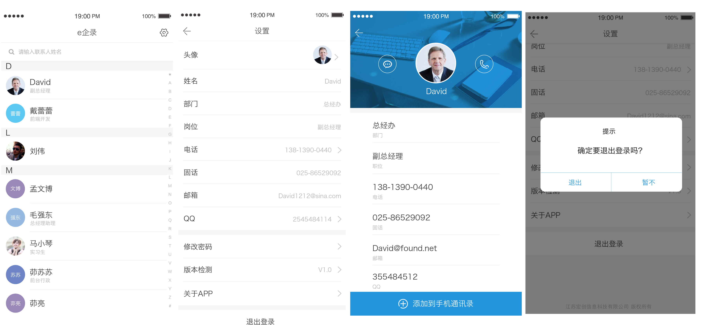

 
#### 3.PPTV远见Foresight（2015/9）
** 项目描述：**
该项目是PPTV为自己的手机内嵌的一个集视频直播，语音通话，视频通讯于一体的APP

** 职责：**
负责支持PPTV北京项目研发中心远见项目组集成VoIP(LinkUsSDK)

** 使用技术：**
项目技能使用：java和Android特有API

** 项目链接：** [远见Foresight：http://yuanjian.pptv.com/](http://yuanjian.pptv.com/)
 
#### 4.苏宁豆芽和千里传音（2015.10）
** 项目描述：**
**1.豆芽**是苏宁内部自用的企业聊天软件，该项目是多终端项目，包括PC（windows，Mac），Android，iOS。该应用集IM（即时消息，包括P2P消息，以及群组消息），文件传输，P2P语音/视频通讯等与一体的应用软件。

**2.千里传音**是苏宁客服用外呼APP，集成LinkUs SDK（不含TCP的版本，采用落地网关的形式）

** 职责：**
负责支持苏宁豆芽项目组和千里传音项目组集成VoIP(LinkUsSDK)

** 使用技术：**
项目技能使用：java和Android特有API

** 项目链接：** [苏宁豆芽：http://meim.suning.com/html/win.html](http://meim.suning.com/html/win.html)

#### 5.iCare（爱健康，2015.11 - 2016.02）
** 项目描述：**
概述：按摩椅中嵌入Android平板端设备，为平板设备开发** 用户中心**，** 蓝牙血压计**，** 蓝牙温度计**，** 健康中心**，**iCare（爱健康）**。同时在手机端开发一个**iCare（爱健康）**APP，可以和平板端的iCare进行通讯。
1、** 用户中心**，在按摩椅的平板端开发一个用户中心，该APP的作用主要是添加家庭成员信息，添加的家庭成员信息将挂载在该设备下，该设备默认为父母端设备。每添加一个成员将会生成一个二维码（二维码扫描出来的结果是一个json字符串，包含平板设备的DUUID即设备唯一标识，以及来自服务器的用户ID，这个ID实在用户中心添加用户成功的时候，服务器返回的），该二维码由子女通过安装iCare在手机端通过APP中二维码扫描功能，扫描自己的二维码（获取DUUID和ID，然后携带这两个字段登录）来登录iCare。
2、** 蓝牙血压计**，根据客户提供的血压计的蓝牙协议，通过蓝牙socket控制血压计测量血压，测量完成后，自动将血压数据上传至云端。以供用户了解自己在一段时间内的血压情况，时刻了解自己的血压状况，关注自己健康状况。
3、** 蓝牙温度计**，与血压计类似，根据客户提供的温度计的蓝牙协议，通过通过蓝牙socket控制额温枪温度计测量温度，测量对象分为人体模式和普通目标模式，温度类型分为摄氏度和华氏度。同样在测量完成后将温度数据上传至云端。
4、** 健康中心**，记录和展示用户最近一段时间类的血压走势，温度状况。
免费消息/免费电话/免费视频通话。基于linkUsSDK集成消息，语音通话和视频通话功能。可以子女进行短信，语音和视频交流。
5、** 平板端iCare（爱健康）**基于linkUsSDK集成消息，语音通话和视频通话功能。可以子女进行短信，语音和视频交流。
6、** 手机端iCare(爱健康)**，同样基于linkUsSDK集成消息，语音通话和视频通话功能。可以子女进行短信，语音和视频交流。同时增加健康模块，随时查看自己和父母的健康状况。

** 职责：**
项目负责人，负责协调Android，iOS以及服务器端的开发工作，跟踪整个项目进度，同时承担Android端所有开发任务。

** 使用技术：**
项目技能使用：java和Android特有API。

** 项目链接：** 无

** 项目截图：**

手机端 ** iCare**截图

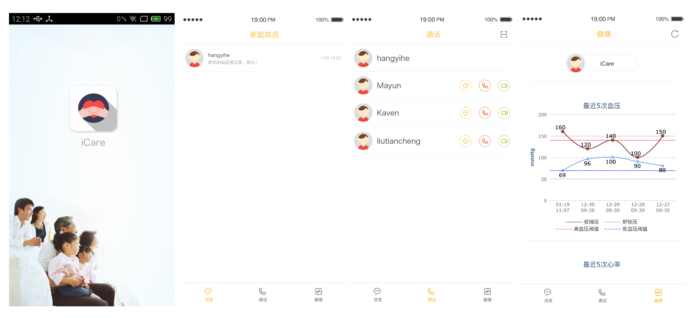

平板端** iCare**截图

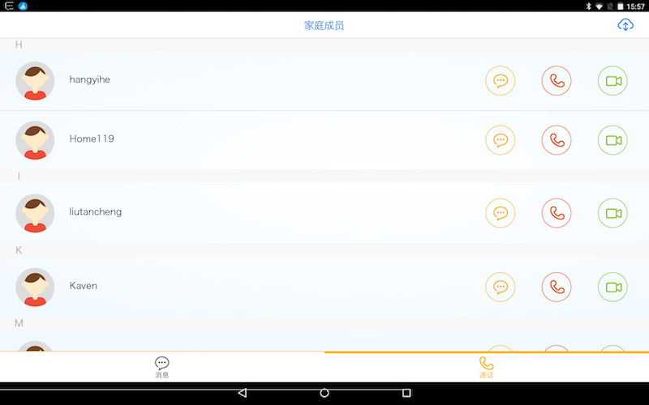
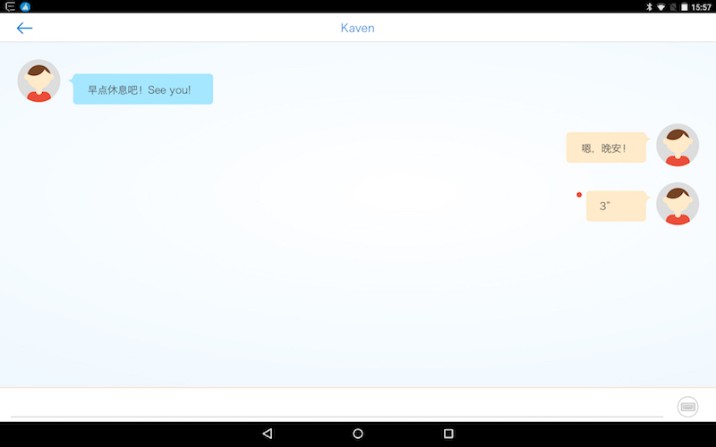
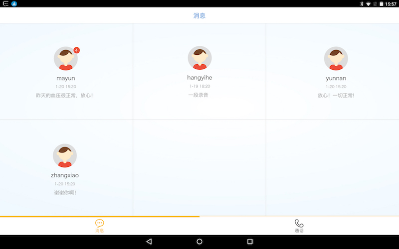

平板端** 用户中心**截图

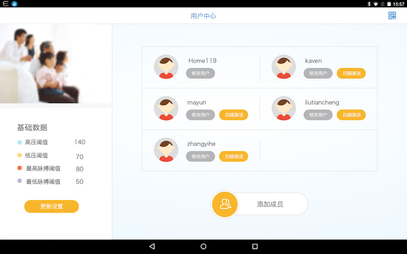
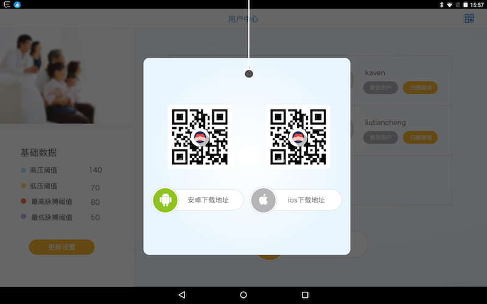
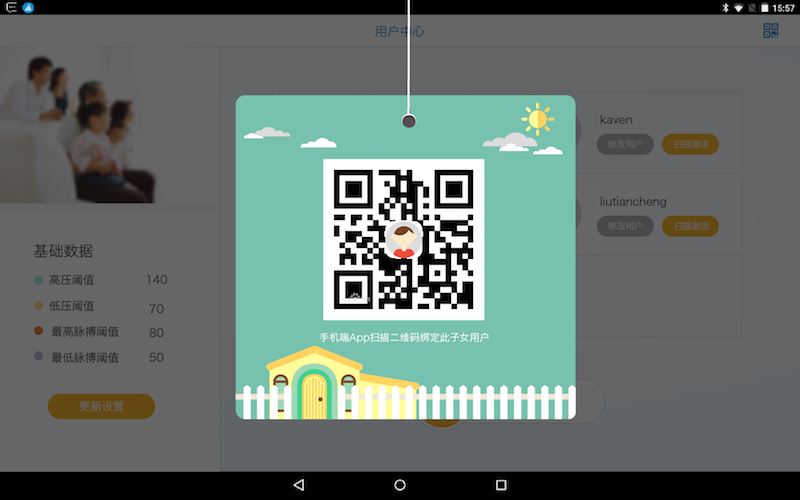
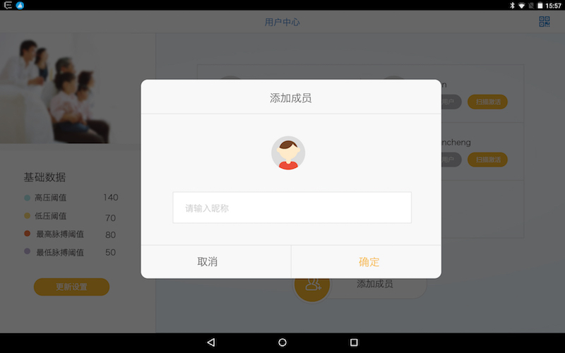

平板端** 蓝牙血压计**截图

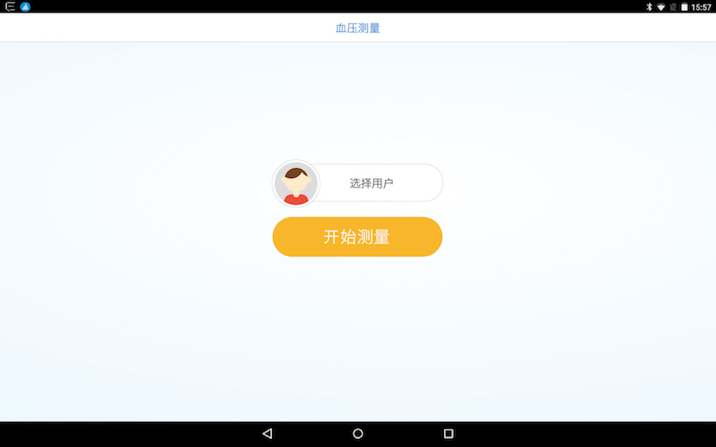
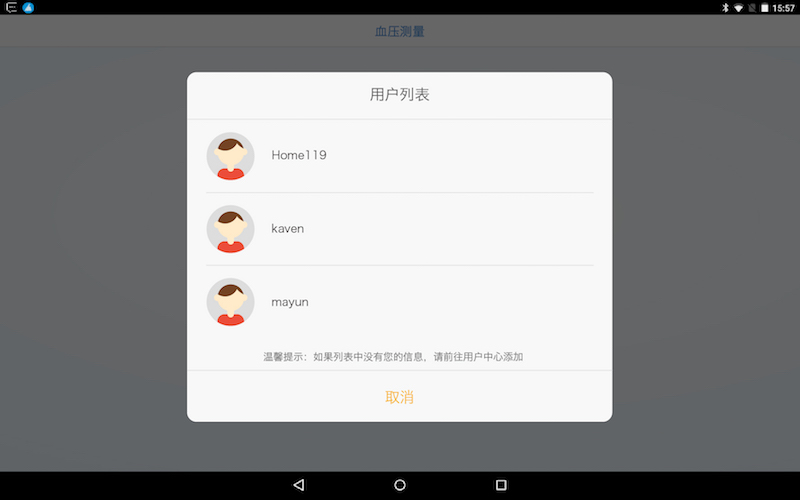
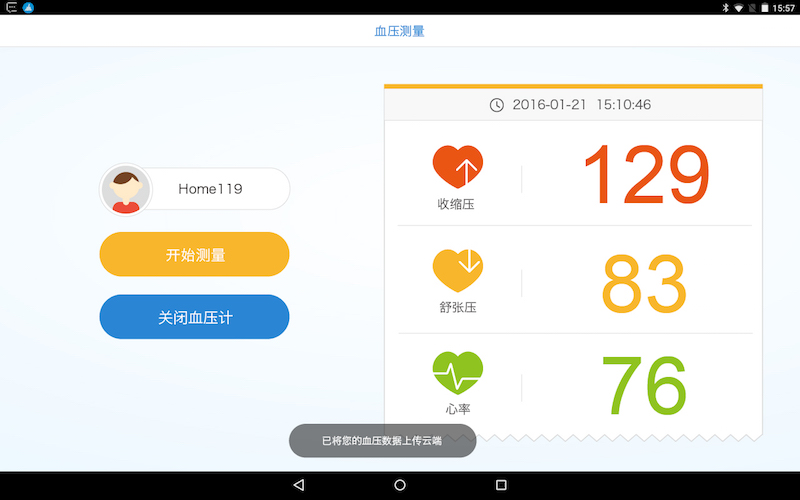

平板端** 蓝牙温度计**截图

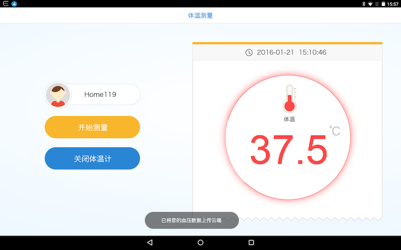

平板端** 健康中心**截图
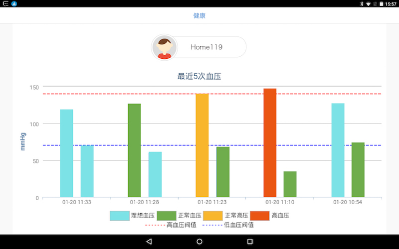

#### 6、LinkUs2 SDK（LinkUs SDK的第二代版本。2015.3 - 2016.10）

** 项目描述：**

** 职责：**

** 使用技术：**
项目技能使用：java和Android特有API。

** 项目链接：** 无

#### 7、C3 Mobile（2016.11-2017.2）

** 项目描述：**
该项目是办公用app。集办公（应用商店，考勤，院内公告）、即时通讯（即时消息，音视频通话）于一体的办公软件。

** 职责：**
1.Auth认证。
2.LinkUs2 SDK集成。定制即时消息，音视频通讯UI。
3.辅助测试

** 使用技术：**
项目技能使用：java和Android特有API。

** 项目链接：** 无

** 项目截图：** 
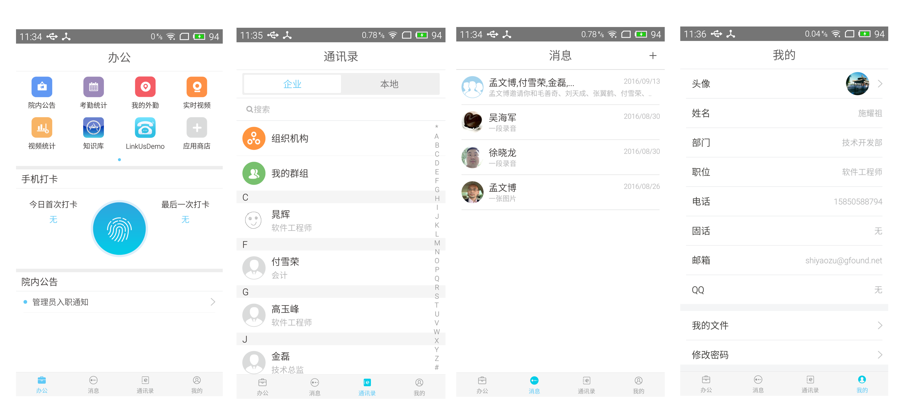

